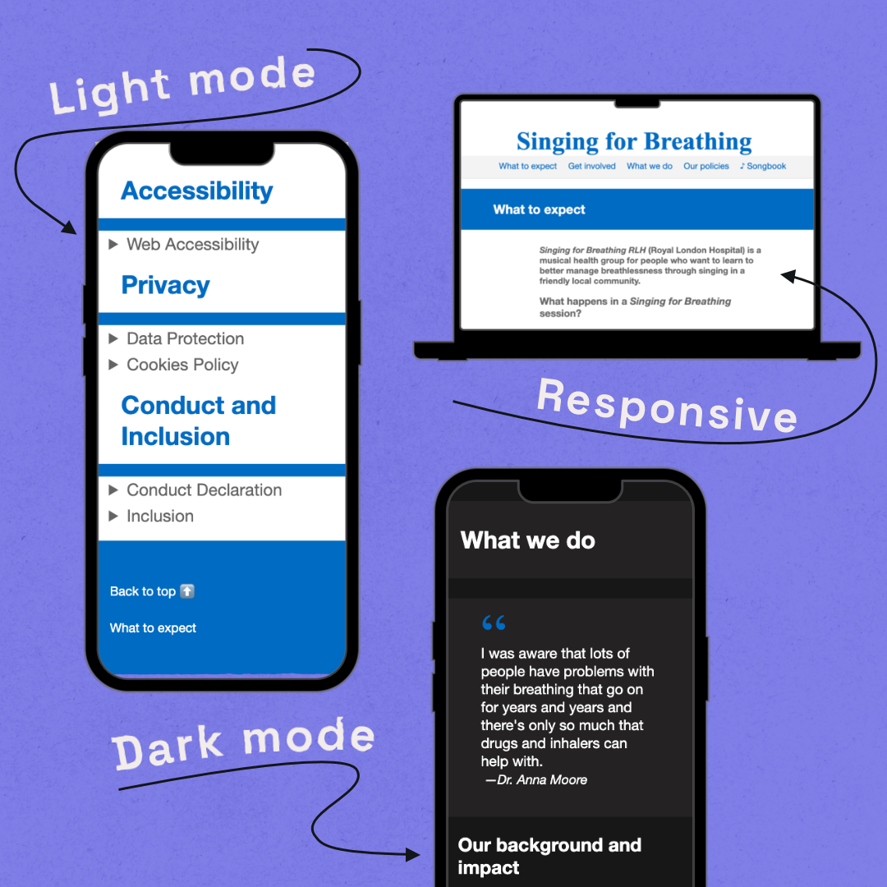

# Singing For Breathing

This is the open repo for the Singing for Breathing RLH community group. The site is in progress and is not yet live.

## Info & Fundraising

You can find out more about the group from the crowdfunder: https://www.crowdfunder.co.uk/p/singing-for-breathing 

And I am raising money for us by doing an around the world Dance Marathon in June: https://www.justgiving.com/crowdfunding/dance-ruth-dance

I am volunteering my time to set up a simple website for free, so the group will be more easily discovered.

### The website



## Content Maintenance

### About the website's technology

The content for the website is written in HTML. To learn the basics of HTML, use the [mdn web docs "HTML Basics" guide](https://developer.mozilla.org/en-US/docs/Learn/Getting_started_with_the_web/HTML_basics).

The text and images etc which are displayed on the site, and written in the file called `index.html`, and specific parts of the content are wrapped in tags so that they will be displayed correctly by web browsers.

The custom style used for the site is written in CSS, and is in a file called `style.css`.

### How to change something

The files can be edited in GitHub directly.  The GitHub docs have instructions for [editing files directly on GitHub using the file editor](https://docs.github.com/en/repositories/working-with-files/managing-files/editing-files).

:bulb: For developers: You can fork the repo and edit in your preferred IDE as normal.

It is worth getting familiar with HTML before making changes yourself, so that you're confident you won't publish mistakes to the website. 

Comments may be included in the code to help you. Comments won't be published on the website, they will only appear in the code files, and will be wrapped in tags like this: `<!-- (comment goes here) -->` 

In general, each section is in a `<div>` with a second level header `<h2>` with the same name as the section, in pascal case.

```html
<div id="whatToExpect">
    <!-- there might be an image here e.g.  -->
    <h2>What to expect</h2>
    <!-- ... more content here ... -->
</div>
```

So, you can search for the div you want to edit, with the file open in the GitHub editor, use `ctrl` + `F` to open your internet browser's search feature, and search for "_What to expect_" or "_whatToExpect_" to find it in the page and jump to that section.

If you add new paragraphs, wrap each one in a `<p>` tag, e.g.:
```html
<p>This is a new paragraph. </p>
```

Use the 'Preview' mode to check your changes.

You can of course request changes to the content from me, or another developer. The site will be Open Access, which means the code will be available for others to use, but users will need permission to publish to our Singing for Breathing website.

### Adding or changing media

Images are saved in the `assets` folder; save any new images in that folder, and if you are replacing an image remove those which are not in use.
It is recommended to use the `webp` web image format, as this is the most efficient and will make our website more energy friendly. `png` or `jpeg` etc are find if `webp` is not available to you.
Try to ensure images are no bigger than they need to be, as large images will take a long time to load.

For that reason, I recommend not to host video media on the website. It is better to provide a link to a website like YouTube or Vimeo instead. It's also preferred to _not_ embed media players from those sites, as it will add cookies to our website and also affect the user experience.

### Updating the songbook

At the moment, all songs are written in HTML in the file `songbook.html`.
This template can be used to add more songs:

1. Search for the section of the first letter of the song title
   - `ctrl`+`F` for example, for " _section id="M"_ "
2. Add the lyrics to the template:
   1. if the song is not in English, add the language, using the [2 or 3 digit language subtag](https://r12a.github.io/app-subtags/) code to the first `<p>` tag:
   -  for example, in Zulu the code is **zu** so we add `lang="zu"` like this: `<p lang="zu" translate="no"><br />`

  - ```html
    <details><summary>My Song</summary>
                <p translate="no"><br />
                    <strong>Alto:</strong><br />
                    Add the lyrics here<br />
                    IT DOESNT MATTER WHICH CASE YOU USE<br />
                    Keep the br tag at the end of each line<br />
                    And add a br tag between each paragraph too<br />
                    <br />
                    <strong>Bass:</strong><br />
                    the strong tag makes text bold<br />
                </p>
            </details>
    ```
  3. If needed, you can copy and past the following link at the end of the lyrics, which takes users to the top of the page where the song navigation is.
   - ```html
           <p><small><a href="#directory">back to top</a></small></p>
      ```
     
**IMPORTANT**: If you're adding the first song for a letter, you will need to update the AtoZ navigation!
1. Search for " _id="directory"_ "
2. Find your letter in the columns, each one is wrapped in `<li>` tags, it will look like this one:
   - `<li>Z</li> `
3. You'll need to add an `<a>` tag with a `href="#LETTER"` to the letter location you need, like this: 
   - `<li><a href="#Z">Z</a></li>`

### Requesting a change

Drop me (Ruth) a message and I'll see what I can do! Changes to the content which don't change the structure of the site are simple. I can demo how to make a change over zoom as well so you can learn this yourself. More complex changes might require more work and testing in the browser, so should be kept to a minimum.
Content on the website should be as evergreen as possible to reduce the need for making changes.

If you notice a bug or a problem, you can also raise an `Issue` on GitHub. This is like a message board for tracking work/progress. Add as much info as you can about the problem so it can be understood and fixed, by me, another user, or in the future.